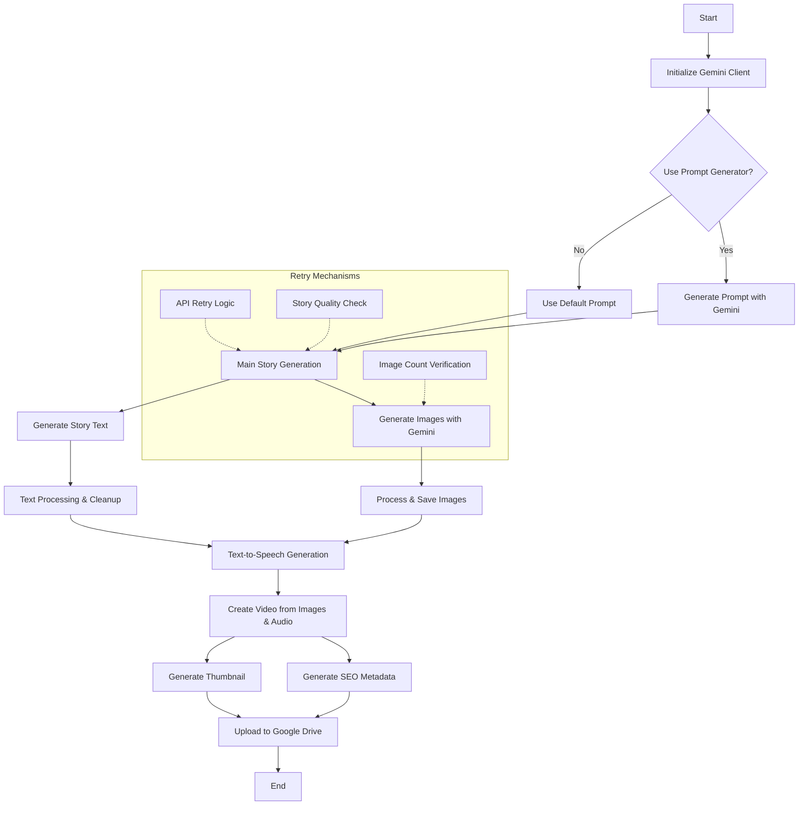

# AI-Powered Children's Story Generator

This project uses Google's Gemini AI to automatically generate children's stories with narration, images, audio, and compiled video output. The system creates a complete story pipeline from prompt to YouTube-ready video.

## Project Structure

The code is organized into several modules based on functionality:

```
Children's Story Generator/
│
├── main.py                   # Main execution script
├── requirements.txt          # Package dependencies
│
├── utils/                    # Utility functions
│   ├── google_drive_utils.py # Google Drive interaction utilities
│   └── api_utils.py          # API interaction utilities and retry mechanisms
│
├── generators/               # Core generators
│   ├── prompt_generation.py  # Story prompt generation
│   ├── story_generator.py    # Story generation and text processing
│   ├── metadata_generator.py # SEO metadata and thumbnail generation
│   └── video_generator.py    # Video creation with FFMPEG
│
└── services/                 # External services integration  
    ├── main_generator.py     # Core generation orchestration
    └── google_drive_upload.py # Google Drive upload service
```

## Pipeline Flow

The story generation follows this pipeline:

1. **API Key & Configuration** (main.py)
   - Sets API keys and configuration
   - Tests Google Drive API connectivity

2. **Prompt Generation** (prompt_generation.py)
   - Uses Gemini AI to create storytelling prompts with animal characters and settings
   - Ensures proper format with 16:9 aspect ratio requirements

3. **Story & Image Generation** (story_generator.py & main_generator.py)
   - Uses Gemini model to generate story text and images simultaneously
   - Processes streaming responses and extracts images
   - Includes robust retry logic for generation failures

4. **Text Processing** (story_generator.py)
   - Cleans up the story text and extracts meaningful segments
   - Ensures proper formatting and removes non-narrative content
   - Validates sufficient content (minimum 6 segments)

5. **Audio Generation** (main_generator.py)
   - Converts story text to speech using Kokoro TTS
   - Creates high-quality audio narration

6. **Video Creation** (video_generator.py)
   - Resizes images to consistent dimensions (1920x1080)
   - Applies professional motion effects and transitions
   - Combines images and audio into a final video

7. **Metadata Generation** (metadata_generator.py)
   - Creates SEO-friendly title, description, and tags
   - Generates custom thumbnail with text overlay

8. **Upload & Delivery** (google_drive_upload.py)
   - Uploads video, thumbnail, and metadata to Google Drive
   - Organizes content in timestamped folders

## Detailed Pipeline Flowchart



The pipeline follows these key stages:

1. **Initialization**: Set up Gemini API client with proper credentials
2. **Prompt Generation**: Either use AI to generate a creative prompt or use a default prompt
3. **Story Generation**: Generate a complete children's story with the Gemini model
4. **Image Generation**: Generate images for each scene in the story
5. **Audio Creation**: Convert the story text to speech using Kokoro
6. **Video Production**: Combine images and audio to create a complete video
7. **Metadata Generation**: Create SEO-friendly metadata and thumbnail
8. **Upload Process**: Upload the final video and associated files to Google Drive

The system includes multiple retry mechanisms to handle API failures, ensure story quality, and verify proper image generation.

## File Details

### Main Execution

- **main.py** (72 lines)
  - Entry point for the application
  - Sets up API keys and safety settings
  - Runs the story generation process

### Utilities

- **google_drive_utils.py** (172 lines)
  - `download_file_from_google_drive()`: Downloads files from Google Drive
  - `test_google_drive_api()`: Tests API connectivity and permissions
  - `upload_text_file_to_drive()`: Uploads text files to Google Drive

- **api_utils.py** (94 lines)
  - `retry_api_call()`: Robust retry mechanism for API calls
  - `get_safety_settings()`: Configures safety parameters for Gemini

### Generators

- **prompt_generation.py** (126 lines)
  - `generate_prompt()`: Creates structured story prompts using Gemini

- **story_generator.py** (233 lines)
  - `retry_story_generation()`: Manages the story generation process
  - `collect_complete_story()`: Processes and cleans story text
  - Contains helper functions for story structure analysis

- **metadata_generator.py** (280 lines)
  - `generate_seo_metadata()`: Creates YouTube-optimized metadata
  - `default_seo_metadata()`: Fallback metadata generation
  - `generate_thumbnail()`: Creates custom video thumbnails

- **video_generator.py** (282 lines)
  - `create_video()`: Creates video from images and audio
  - Applies professional motion effects and transitions
  - Handles FFMPEG processing with fallbacks

### Services

- **main_generator.py** (368 lines)
  - `generate()`: Core function orchestrating the entire generation process
  - Coordinates story, image, audio, and video creation
  - Handles various error cases and regeneration

- **google_drive_upload.py** (173 lines)
  - `upload_to_google_drive()`: Uploads all assets to Google Drive
  - Creates organized folder structure
  - Provides direct download links

## Requirements and Dependencies

See the requirements.txt file for all dependencies. Key libraries include:

- google-generativeai: For Gemini model access
- kokoro: For text-to-speech functionality
- PIL/Pillow: For image processing
- ffmpeg: For video creation (system dependency)
- soundfile/numpy: For audio processing
- google-api-python-client: For Google Drive integration

## API Keys

The project requires a Google Gemini API key to be set in the environment:
```python
os.environ['GEMINI_API_KEY'] = "YOUR_API_KEY_HERE"
```

## Usage

1. Install dependencies: `pip install -r requirements.txt`
2. Set your Gemini API key in main.py
3. Run the application: `python main.py`
